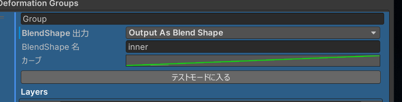
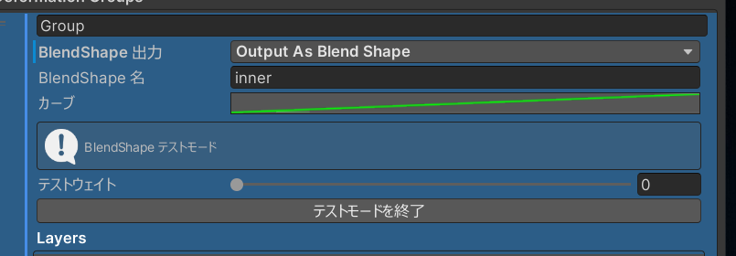
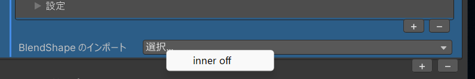

Lattice Deformation Tool では、変形結果を BlendShape (ShapeKey) として出力したり、既存の BlendShape をブラシレイヤーとしてインポートして編集したりできます。

## BlendShape 出力

グループ単位で変形結果を BlendShape として出力できます。直接メッシュを変形する代わりに ShapeKey を生成するため、VRChat 上でアニメーションやメニューから動的に変形を制御できます。

### 設定手順

1. Inspector のグループ設定で `BlendShape 出力` を `OutputAsBlendShape` に変更します。
2. `BlendShape 名` にメッシュに生成される BlendShape の名前を設定します (デフォルトで GameObject 名が入ります)。
3. `カーブ` でアニメーションカーブを編集し、0%〜100% の変化をカスタマイズできます。

{/* BlendShape 出力設定の Inspector スクリーンショット。BlendShape 出力ドロップダウン、名前フィールド、カーブエディタが見える状態 */}

### BlendShape 出力モード

| モード               | 説明                                                   |
| -------------------- | ------------------------------------------------------ |
| `Disabled`           | 通常の直接変形 (デフォルト)                            |
| `OutputAsBlendShape` | 変形結果をメッシュに直接適用せず BlendShape として出力 |

### カーブ

アニメーションカーブで BlendShape の 0〜100% の変化を制御します。デフォルトは線形 (0→1) ですが、イージングカーブを設定すると段階的な変化を表現できます。

### テストモード

BlendShape 出力を設定した後、`テストモードに入る` ボタンで効果をリアルタイムにプレビューできます。

1. `テストモードに入る` をクリック
2. `テストウェイト` スライダー (0〜100%) で BlendShape の強度を調整
3. Scene ビューでリアルタイムに変形を確認
4. `テストモードを終了` で通常の編集に戻る

{/* テストモード中の Inspector スクリーンショット。テストウェイトスライダーが表示されている状態 */}

## BlendShape インポート

既存メッシュの BlendShape をブラシレイヤーとして読み込むことで、BlendShape の形状を編集したり、他のレイヤーと組み合わせたりできます。

### インポート手順

1. Inspector の `BlendShape のインポート` セクションを開きます。
2. ドロップダウンからインポートしたい BlendShape を選択します。
3. 選択すると、その BlendShape のデルタが新しいブラシレイヤーとして追加されます。

{/* BlendShape インポートのドロップダウンメニューのスクリーンショット */}

:::tip
インポートした BlendShape はブラシレイヤーになるため、ブラシツールや頂点選択ツールでさらに編集を加えることができます。
:::

## 活用例

### 表情の微調整

1. アバターの既存の表情 BlendShape をインポート
2. ブラシツールで口角の位置を微調整
3. BlendShape として再出力

### アニメーション制御可能な変形

1. 体型変更をグループにまとめる
2. BlendShape 出力を有効にする
3. VRChat のメニューから BlendShape の値を制御して動的に体型を変更
