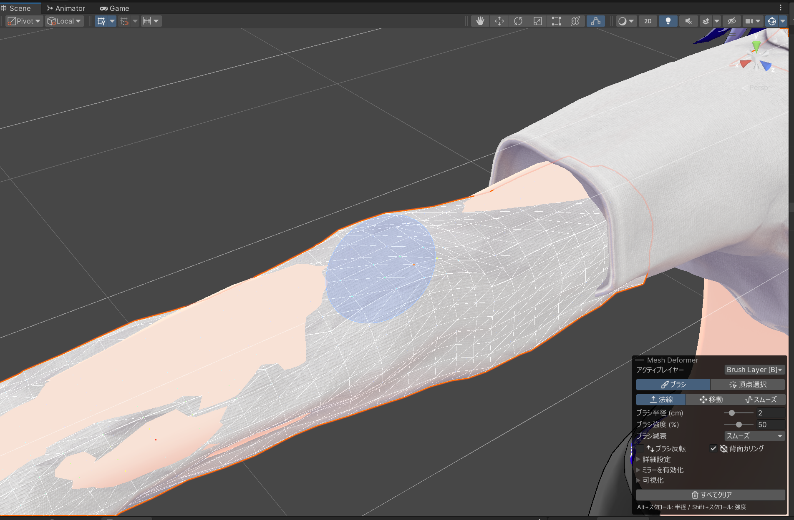
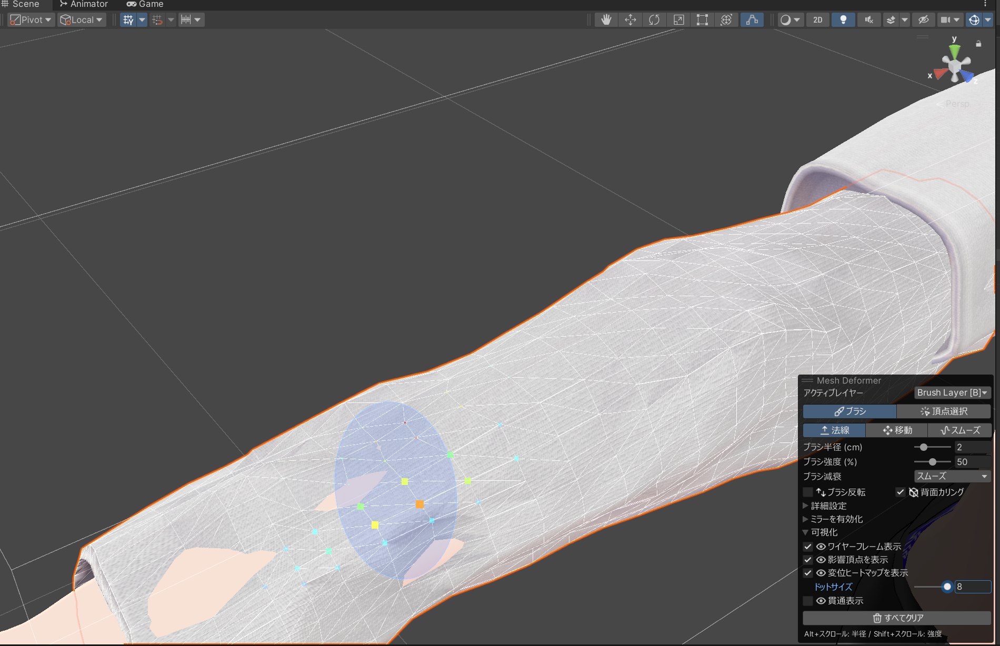

export const Icon = ({name, alt}) => (
  
);

<Icon name="brush" alt="ブラシツール" /> ブラシツールを使うと、メッシュ表面を塗るように直感的に変形できます。ブラシレイヤー `[B]` を選択した状態で使用します。

## ブラシツールの起動

1. Inspector のレイヤーリストでブラシレイヤー `[B]` を選択します。
2. `ブラシエディターを開く` ボタンをクリックするか、Scene ビューのツールバーから <Icon name="brush" /> `Mesh Deformer` ツールを選択します。
3. Scene ビューにブラシカーソルが表示され、オーバーレイパネルにブラシ設定が表示されます。

{/* ブラシツール起動後の Scene ビューのスクリーンショット。ブラシカーソル (円形) とオーバーレイパネルが見える状態 */}

## ブラシモード

ブラシには 4 つのモードがあり、オーバーレイの `ブラシ変形` セクションで切り替えます。

| モード                |        アイコン        | 説明                                                                       |
| --------------------- | :--------------------: | -------------------------------------------------------------------------- |
| **法線** (Normal)     | <Icon name="normal" /> | メッシュの法線方向に沿って表面を押し出し・引き込み。最も基本的なモード     |
| **移動** (Move)       |  <Icon name="move" />  | スクリーン上でドラッグした方向にメッシュを移動。法線に依存しない自由な移動 |
| **スムーズ** (Smooth) | <Icon name="smooth" /> | ブラシ範囲内の変形を平滑化。凹凸をなだらかにする                           |

{/* 法線モードで押し出し操作中のスクリーンショット。ブラシで膨らませている様子 */}

## ブラシ設定

| 設定                                | 説明                                    |
| ----------------------------------- | --------------------------------------- |
| `ブラシ半径`                        | ブラシの影響範囲の大きさ (ワールド空間) |
| `ブラシ強度`                        | 各ストロークで適用される変位量 (0〜1)   |
| `ブラシ減衰`                        | ブラシの中心から端にかけての減衰カーブ  |
| <Icon name="invert" /> `ブラシ反転` | 効果の方向を反転 (押し出し ↔ 引き込み)  |

### 減衰タイプ

| タイプ       | 特徴                                       |
| ------------ | ------------------------------------------ |
| `スムーズ`   | 滑らかに減衰 (Smoothstep)                  |
| `リニア`     | 一定の割合で線形に減衰                     |
| `一定`       | 範囲全体に均一に適用 (端で急に切れる)      |
| `球体`       | 柔らかい円形の減衰                         |
| `ガウシアン` | ガウス分布型の鐘型カーブ。自然な変形に最適 |

### ショートカット

| 操作               | 挙動             |
| ------------------ | ---------------- |
| Alt + スクロール   | ブラシ半径を調整 |
| Shift + スクロール | ブラシ強度を調整 |
| 左マウスドラッグ   | ブラシを塗る     |

## <Icon name="mirror" /> ミラー編集

オーバーレイの <Icon name="mirror" /> `ミラーを有効化` をオンにすると、対称軸を挟んで両側に同時にブラシを適用できます。`ミラー軸` で X / Y / Z のいずれかを選択します。

VRChat アバターの左右対称編集に便利です。

## 詳細設定

オーバーレイの `詳細設定` (`Advanced`) セクションで以下の設定を調整できます。

|             アイコン             | 設定           | 説明                                                                                     |
| :------------------------------: | -------------- | ---------------------------------------------------------------------------------------- |
|    <Icon name="connected" />     | `接続のみ`     | ブラシ影響をメッシュのトポロジーで接続された頂点に限定。別パーツへの意図しない影響を防止 |
| <Icon name="surface-distance" /> | `表面距離`     | メッシュ表面に沿った距離でブラシ範囲を計算。薄いメッシュの裏側への漏れを防止             |
|  <Icon name="backface-cull" />   | `背面カリング` | カメラから見える面のみにブラシを適用                                                     |

## <Icon name="eye" /> 可視化オプション

|      アイコン       | オプション               | 説明                                                                              |
| :-----------------: | ------------------------ | --------------------------------------------------------------------------------- |
| <Icon name="eye" /> | `ワイヤーフレーム表示`   | メッシュのエッジを線で表示                                                        |
| <Icon name="eye" /> | `影響頂点を表示`         | ブラシ範囲内の頂点をドットで表示                                                  |
| <Icon name="eye" /> | `変位ヒートマップを表示` | 変形量をレインボーカラーで可視化。どの部分がどれだけ変形しているか一目でわかる    |
| <Icon name="eye" /> | `貫通表示`               | 参照メッシュを貫通している頂点を赤で表示。`参照メッシュ` に比較対象を設定して使用 |
|                     | `ドットサイズ`           | 頂点インジケーターの表示サイズを調整                                              |

{/* 変位ヒートマップが有効な状態のスクリーンショット。レインボーカラーで変形量が可視化されている様子 */}
