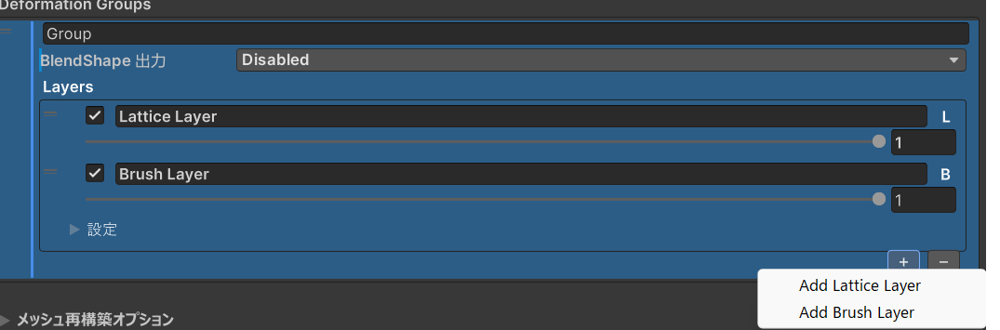
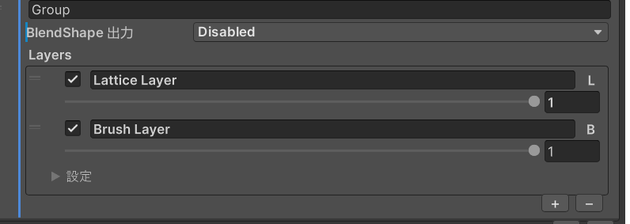

Lattice Deformation Tool はレイヤーとグループの 2 階層でメッシュ変形を管理します。このページではそれぞれの概念と操作方法を解説します。

## 概要

```
LatticeDeformer コンポーネント
├── グループ 1 (Deformation Group)
│   ├── レイヤー 1 [L] ラティスレイヤー
│   ├── レイヤー 2 [B] ブラシレイヤー
│   └── レイヤー 3 [L] ラティスレイヤー
├── グループ 2
│   └── レイヤー 1 [B] ブラシレイヤー
└── ...
```

- **レイヤー**: 個々の変形操作を保持します。ラティスレイヤー `[L]` とブラシレイヤー `[B]` の 2 種類があります。
- **グループ**: 複数のレイヤーをまとめた変形セットです。グループ単位で BlendShape 出力を設定できます。

## レイヤーの種類

### ラティスレイヤー `[L]`

ラティスケージの制御点を操作してメッシュを変形します。大まかな形状変更に向いています。

- グリッド分割数、ローカルバウンズ、補間方式 (Trilinear / Cubic Bernstein) をレイヤーごとに設定可能
- 対称編集に対応

### ブラシレイヤー `[B]`

ブラシで塗るように頂点ごとの変位を記録します。細かな微調整に向いています。

- 法線・移動・スムーズ・マスクの 4 モード
- 頂点選択ツールでの直接頂点操作にも対応

## レイヤーの操作

{/* Inspector のレイヤーリスト部分のスクリーンショット。追加・削除・複製ボタンが見える状態 */}


### レイヤーの追加

Inspector のレイヤーセクション下部にあるボタンから追加します。

- **ラティスレイヤーを追加** (`Add Lattice Layer`) — 新しいラティスレイヤーを作成
- **ブラシレイヤーを追加** (`Add Brush Layer`) — 新しいブラシレイヤーを作成

### レイヤーの選択

レイヤーリストで項目をクリックするとアクティブレイヤーになります。アクティブレイヤーが編集対象になり、対応するツール (ラティスツールまたはブラシツール) で操作できます。

### その他の操作

| 操作                                      | 説明                                           |
| ----------------------------------------- | ---------------------------------------------- |
| `レイヤーを複製`                          | アクティブレイヤーをデータごとコピーして追加   |
| `レイヤーをコピー` / `レイヤーを貼り付け` | レイヤーをクリップボード経由でコピー＆ペースト |
| `レイヤーを削除`                          | アクティブレイヤーをグループから削除           |

レイヤーはリスト内でドラッグして並べ替えることもできます。レイヤーの適用順序はリストの上から下の順番です。

### レイヤーのプロパティ

各レイヤーには以下のプロパティがあります。

| プロパティ | 説明                                                 |
| ---------- | ---------------------------------------------------- |
| 名前       | レイヤーの表示名 (自由に変更可能)                    |
| 有効/無効  | レイヤーのオン・オフ。無効にすると変形に含まれません |
| ウェイト   | 0〜1 の値でレイヤーの変形量をブレンドします          |

## グループの操作

{/* Inspector の変形グループセクションのスクリーンショット */}


### グループの役割

グループは独立した変形セットです。主な使いどころは以下です。

- **BlendShape 出力**: グループ単位で変形結果を BlendShape として出力できます (詳細は [BlendShape](./blendshape.md) を参照)。
- **変形の分離**: たとえば「顔の形状変更」と「体型の調整」を別グループに分けて管理できます。

### グループの操作

| 操作                                      | 説明                                           |
| ----------------------------------------- | ---------------------------------------------- |
| `グループを複製`                          | アクティブグループを全レイヤーごとコピー       |
| `グループをコピー` / `グループを貼り付け` | グループをクリップボード経由でコピー＆ペースト |
| `グループを削除`                          | アクティブグループとその全レイヤーを削除       |

## 変形の適用順序

レイヤーの変形はリストの上から下へ順番に適用されます。レイヤーの並び順を変えると最終的な変形結果が変わる場合があるため、意図した順番になっているか確認してください。

グループが複数ある場合は、各グループの変形結果が合成されて最終メッシュが生成されます。
