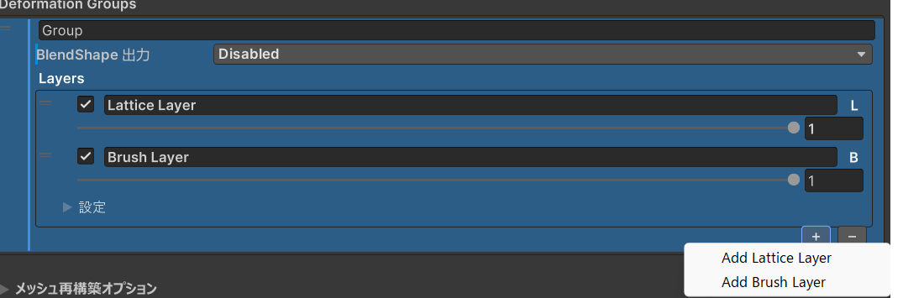
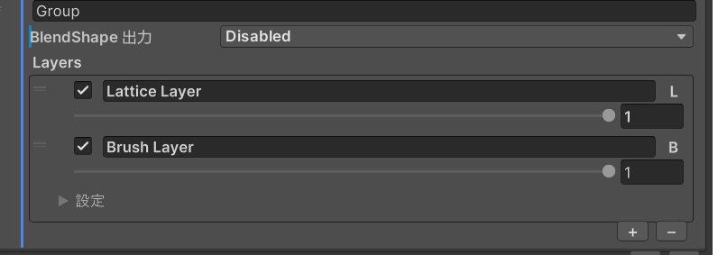

変形を一つの操作へまとめると、後から一部だけ戻したり、強さを調整したりできません。
Lattice Deformation Tool は、個々の変形を**レイヤー**に記録し、関連するレイヤーを**グループ**へまとめます。

## 概要

```
LatticeDeformer コンポーネント
├── グループ 1 (Deformation Group)
│   ├── レイヤー 1 [L] ラティスレイヤー
│   ├── レイヤー 2 [B] ブラシレイヤー
│   └── レイヤー 3 [L] ラティスレイヤー
├── グループ 2
│   └── レイヤー 1 [B] ブラシレイヤー
└── ...
```

- **レイヤー**：個々の変形操作を保持します。
  ラティスレイヤー `[L]` とブラシレイヤー `[B]` の二種類があります。
- **グループ**：複数のレイヤーをまとめた変形セットです。
  グループ単位で BlendShape 出力を設定できます。

## レイヤーの種類

### ラティスレイヤー `[L]`

ラティスケージの制御点を操作してメッシュを変形します。
大まかな形状変更に向いています。

- グリッド分割数、ローカルバウンズ、補間方式（Trilinear または Cubic Bernstein）をレイヤーごとに設定可能
- 対称編集に対応

1.4.2 で新しく作成した `Cubic Bernstein` データには、現行の Bernstein 評価が使われます。
一方、旧公開バージョンから移行したデータには、既存の変形結果を維持するため従来互換の評価が使われます。

### ブラシレイヤー `[B]`

ブラシで塗るように頂点ごとの変位を記録します。
細かな微調整に向いています。

- 標準 UI では法線、移動、スムーズの 3 モード
- 頂点選択ツールでの直接頂点操作にも対応

## レイヤーの操作

{/* Inspector のレイヤーリスト部分のスクリーンショット。追加、削除、複製ボタンが見える状態 */}


### レイヤーの追加

Inspector のレイヤーセクション下部にあるボタンから追加します。

- **ラティスレイヤーを追加**（`Add Lattice Layer`）：新しいラティスレイヤーを作成
- **ブラシレイヤーを追加**（`Add Brush Layer`）：新しいブラシレイヤーを作成

### レイヤーの選択

レイヤーリストで項目をクリックするとアクティブレイヤーになります。
Scene ビューでは、単一の `Mesh Deformer` ツールがアクティブレイヤーに応じてラティス編集またはブラシ編集へ切り替わります。
ブラシレイヤーでは、オーバーレイからブラシと頂点選択を切り替えられます。

### その他の操作

| 操作                                      | 説明                                           |
| ----------------------------------------- | ---------------------------------------------- |
| `レイヤーを複製`                          | アクティブレイヤーをデータごとコピーして追加   |
| `レイヤーをコピー` / `レイヤーを貼り付け` | レイヤーをクリップボード経由でコピー＆ペースト |
| `レイヤーを削除`                          | アクティブレイヤーをグループから削除           |

レイヤーはリスト内でドラッグして並べ替えられます。
変形はリストの上から下へ適用されるため、同じレイヤーでも並び順によって結果が変わる場合があります。

### レイヤーのプロパティ

各レイヤーには以下のプロパティがあります。

| プロパティ | 説明                                                 |
| ---------- | ---------------------------------------------------- |
| 名前       | レイヤーの表示名（自由に変更可能）                    |
| 有効/無効  | レイヤーのオンとオフ。無効にすると変形に含まれません |
| ウェイト   | 0〜1 の値でレイヤーの変形量をブレンドします          |

## グループの操作

{/* Inspector の変形グループセクションのスクリーンショット */}


### グループの役割

グループは独立した変形セットです。
主な使いどころは以下です。

- **BlendShape 出力**：グループ単位で変形結果を BlendShape として出力できます。
  詳しくは [BlendShape](./blendshape.md) を参照してください。
- **変形の分離**：たとえば「顔の形状変更」と「体型の調整」を別グループに分けて管理できます。

### グループの操作

| 操作                                      | 説明                                           |
| ----------------------------------------- | ---------------------------------------------- |
| `グループを複製`                          | アクティブグループを全レイヤーごとコピー       |
| `グループをコピー` / `グループを貼り付け` | グループをクリップボード経由でコピー＆ペースト |
| `グループを削除`                          | アクティブグループとその全レイヤーを削除       |

## 変形の適用順序

レイヤーの変形は、リストの上から下へ順番に適用されます。
並び替えた後は、意図した結果になっているかプレビューで確認してください。

グループが複数ある場合は、各グループの変形結果が合成されて最終メッシュが生成されます。
