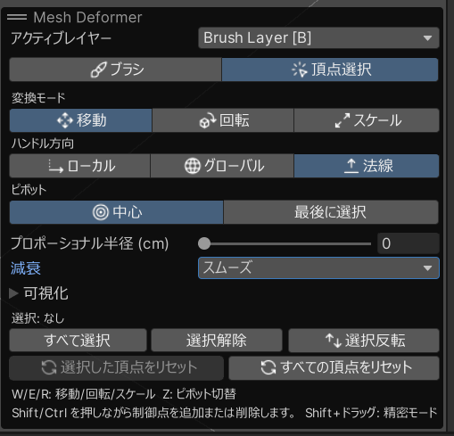
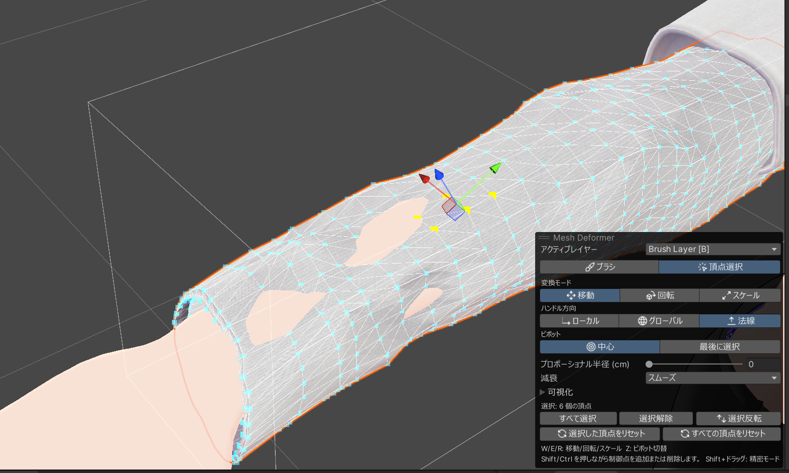

export const Icon = ({name, alt}) => (
  
);

<Icon name="vertex-select" alt="頂点選択ツール" /> 頂点選択ツールを使うと、ブラシレイヤー上の頂点を直接選択して移動・回転・スケールで変形できます。ブラシモードでは難しい正確な位置合わせや均一な変形に向いています。

## 頂点選択ツールの起動

1. Inspector のレイヤーリストでブラシレイヤー `[B]` を選択します。
2. `ブラシエディターを開く` でツールを起動した後、オーバーレイ上部のモード切替で <Icon name="vertex-select" /> `頂点選択` を選択します。

{/* オーバーレイのモード切替部分。 <Icon name="brush" /> ブラシ と <Icon name="vertex-select" /> 頂点選択 のタブが見えるスクリーンショット */}

## 頂点の選択

| 操作             | 挙動                          |
| ---------------- | ----------------------------- |
| クリック         | 頂点を選択 (既存の選択は解除) |
| Shift + クリック | 選択に追加                    |
| Ctrl + クリック  | 選択をトグル                  |
| ドラッグ         | 矩形範囲で複数選択            |

- 選択された頂点は **黄色**、未選択は **青色** で表示されます。
- `すべて選択` / `選択解除` ボタンで一括操作も可能です。
- <Icon name="connected" /> `接続のみ` をオンにすると、矩形選択がメッシュ接続された頂点のみに制限されます。

{/* 頂点選択ツールで複数頂点が選択された状態のスクリーンショット。黄色 (選択) と青色 (未選択) の頂点、移動ハンドルが見える状態 */}

## 変換モード

選択した頂点を 3 つのモードで変形できます。キーボードショートカットで素早く切り替えられます。

| モード       |        アイコン        | キー | 説明                                     |
| ------------ | :--------------------: | ---- | ---------------------------------------- |
| **移動**     |  <Icon name="move" />  | W    | 選択した頂点をハンドルで移動             |
| **回転**     | <Icon name="rotate" /> | E    | 選択した頂点をピボットを中心に回転       |
| **スケール** | <Icon name="scale" />  | R    | 選択した頂点をピボットを中心に拡大・縮小 |

### <Icon name="pivot" /> ピボット

回転・スケールの基準点 (ピボット) を切り替えられます。

| モード       | 説明                     |
| ------------ | ------------------------ |
| `中心`       | 選択中の全頂点の平均位置 |
| `最後に選択` | 最後に選択した頂点の位置 |

`Z` キーでピボットモードを切り替えできます。

## <Icon name="proportional" /> プロポーショナル編集

プロポーショナル編集を有効にすると、選択した頂点の周囲にある頂点も減衰カーブに応じて一緒に移動します。滑らかな変形が必要な場合に便利です。

{/* プロポーショナル編集が有効な状態のスクリーンショット。緑色の影響半径が表示されている様子 */}

| 設定                                                | 説明                                                            |
| --------------------------------------------------- | --------------------------------------------------------------- |
| <Icon name="proportional" /> `プロポーショナル編集` | 有効/無効の切り替え                                             |
| `プロポーショナル半径`                              | 影響が周囲に広がる範囲                                          |
| `減衰`                                              | 減衰カーブの種類 (スムーズ / リニア / 一定 / 球体 / ガウシアン) |

### ショートカット

| 操作             | 挙動                                                                                             |
| ---------------- | ------------------------------------------------------------------------------------------------ |
| W / E / R        | <Icon name="move" /> 移動 / <Icon name="rotate" /> 回転 / <Icon name="scale" /> スケール切り替え |
| Z                | <Icon name="pivot" /> ピボットモード切り替え                                                     |
| Alt + スクロール | プロポーショナル半径を調整                                                                       |
| Shift + ドラッグ | 精密モード (ハンドル操作を細かく)                                                                |

## <Icon name="reset" /> リセット操作

|       アイコン        | ボタン                   | 説明                                         |
| :-------------------: | ------------------------ | -------------------------------------------- |
| <Icon name="reset" /> | `選択した頂点をリセット` | 選択中の頂点の変位データのみをクリア         |
| <Icon name="reset" /> | `すべての頂点をリセット` | レイヤー内のすべての頂点の変位データをクリア |

## <Icon name="eye" /> 可視化オプション

|           アイコン            | オプション             | 説明                             |
| :---------------------------: | ---------------------- | -------------------------------- |
|      <Icon name="eye" />      | `ワイヤーフレーム表示` | メッシュのエッジを線で表示       |
|                               | `ドットサイズ`         | 頂点の表示サイズを調整           |
| <Icon name="backface-cull" /> | `背面カリング`         | カメラから見える面の頂点のみ表示 |
