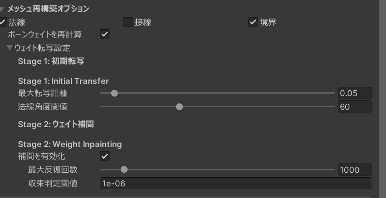

メッシュを大きく変形すると、元のボーンウェイトでは関節の曲がり方が不自然になる場合があります。ウェイト転送機能を使うと、変形後のメッシュに合わせてボーンウェイトを自動的に再計算できます。

## 有効化

1. Inspector の `メッシュ再構築オプション` セクションを展開します。
2. `ボーンウェイトを再計算` をオンにします。

:::note
ボーンウェイトの再計算は `Skinned Mesh Renderer` を使用するメッシュでのみ利用可能です。静的メッシュ (`MeshFilter`) では使用できません。
:::

有効にすると、`ウェイト転写設定` セクションが表示されます。

{/* ウェイト転写設定セクションが表示された Inspector のスクリーンショット */}

## 動作の流れ

ウェイト転送は 2 段階で処理されます。

1. **Stage 1 — 初期転写**: 変形後の各頂点について、元メッシュの近い頂点からボーンウェイトをコピーします。距離や法線角度の条件に合わない頂点は次の段階に回されます。
2. **Stage 2 — ウェイト補間**: Stage 1 で転写できなかった頂点のウェイトを、周囲の頂点から滑らかに補完します。メッシュの形状に沿った自然なウェイト分布が生成されます。

## 設定項目

### Stage 1: 初期転写

| 設定           | デフォルト | 説明                                                                 |
| -------------- | ---------- | -------------------------------------------------------------------- |
| `最大転写距離` | 0.05       | 元メッシュの対角線に対する割合。この距離以内の頂点からウェイトを転写 |
| `法線角度閾値` | 60°        | 元メッシュと変形後メッシュの法線の角度差がこの閾値以内の場合のみ転写 |

### Stage 2: ウェイト補間

| 設定           | デフォルト | 説明                                                 |
| -------------- | ---------- | ---------------------------------------------------- |
| `補間を有効化` | オン       | ウェイト補間の有効/無効                              |
| `最大反復回数` | 1000       | 反復回数の上限。多いほど精度が上がるが処理が遅くなる |
| `収束判定閾値` | 1e-6       | 収束の判定基準。下げるほど精密                       |

## 使用の目安

- **小さな変形**: 通常は無効のままで問題ありません。元のウェイトで十分な結果が得られます。
- **大きな変形**: 頂点がボーンから大きく離れる変形 (体型の大幅な変更など) ではウェイト再計算を有効にすると、関節の動きが改善されます。
- **パフォーマンス**: ウェイト転送はビルド時にのみ実行されるため、編集中のパフォーマンスには影響しません。

:::tip
まずデフォルト設定で試し、関節の動きが不自然な場合にパラメータを調整するのがおすすめです。
:::
